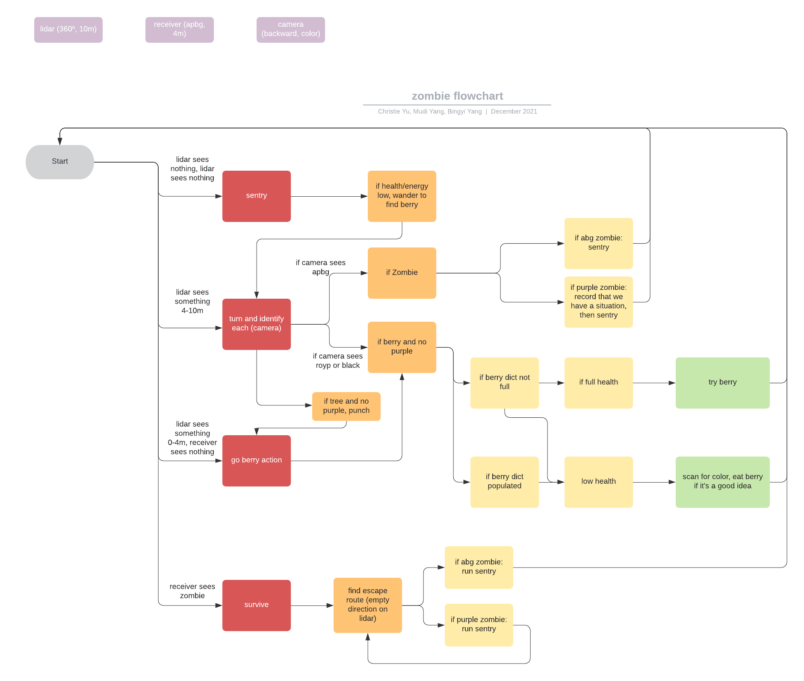

# zombie-world-427
Final project for CPSC 427 (Intelligent Robotics) at Yale, with Mudi Yang and Bingyi Yang.

## Project Instructions
For this project, Mudi, Bingyi and I used Webots to defend a Kuka Youbot from zombies in a (Webots)[https://cyberbotics.com/] simulated world. We were allotted certain sensors (which we could 'purchase' with a set budget). In addition to four types of zombies, there were also berries, trees, stumps, and walls in the world which we also needed to account for, for maximum survivability.

## Project Approach

After reading the specs and test case scenarios, we decided immediately to purchase three sensors: the Lidar, the Receiver, and Camera 8 (we chose this camera because it had high resolution and was just within budget). We decided on these sensors in order to separate the robot’s behaviors into three easy sensing ranges: beyond 10m away from the robot, between 4-10m away from the robot, and within 4m of the robot. This would give us neat layers for a subsumption-esque architecture, which would separate behaviors very cleanly into a state machine, on the technical side. A summary of some behaviors is included below:

### Beyond 10m:
If all entities are beyond 10m of the robot, the Lidar will simply give no reading, and the robot will not move unless its health/energy are low, in which case it will explore for berries. This mode is called “Sentry.”

### From 4-10m away:
If something is between 4-10m away from the robot, the Lidar will tell us a reading but the receiver will not give us information. In that case, we should enter a mode called “Turn & ID,” which lets the robot stay turning without moving forward. 
This, in conjunction with the Camera, allows us to spot larger concern dangers from afar, specifically purple zombies, which would alter our higher-view berry-chasing behavior.
Also, in this mode, as long as the robot is health/energy-stable, it is able to test out berries so that in a potential future emergency, it has some knowledge of berry effects.
If the robot is not health/energy-stable, this is the best time to seek safe berries (“Berry Action”).

### From 0-4m away:
If something is within 4m away and not on the receiver, it is safe to proceed with the regular “Berry Action” method, while processing whether it is a berry, tree, or stump — unless we have already detected purple zombies in the map, in which case trees are somewhat unsafe.
If something is within 4m away and on the receiver, the robot enters “Survival” mode: it chooses the place most open (the widest extent of long distances on the Lidar) and prioritizes running above all.
